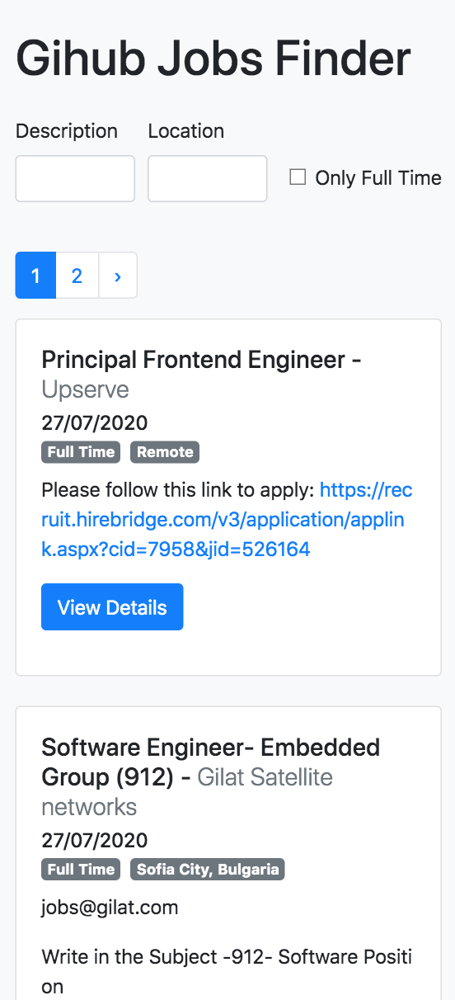

<h1 align="center">
    
</h1>
<h1 align="center">
    
    
</h1>

## 💻 About project

Responsive project built using ReactJs and Axios to get data from Github Jobs API and show all the jobs opportunities that are open at Github. Also, you can search by any name or location, that it will show the jobs filtered with all the details.

## 🛠 Technology

#### **Website**

-   **[HTML5](https://developer.mozilla.org/pt-BR/docs/Web/HTML/HTML5)**
-   **[CSS3](https://www.w3schools.com/css/)**
-   **[React Bootstrap](https://react-bootstrap.github.io/)**
-   **[ReactJS](https://pt-br.reactjs.org/)**: useState, useEffect, useReducer.
-   **[Axios](https://www.npmjs.com/package/axios)**

#### **Utilitaries**

-   Editor: **[Visual Studio Code](https://code.visualstudio.com/)**
-   API: **[Github Jobs Api](https://jobs.github.com/api)**

### Prerequisites

Before you begin, you will need to have the following tool installed on your machine:
[Git](https://git-scm.com)

In addition, it is good to have an editor to work with the code as **[VSCode](https://code.visualstudio.com/)**

### Running the web application (Front End)

```bash
# Clone this repository
$ git clone https://github.com/luizmr/github-jobs-finder-app.git

# Access the project folder in the cmd/terminal
$ cd github-jobs-finder-app

# Use the command below to install all dependencies
$ npm install

# Install http-server
$ npx http-server

# Run the application on terminal
$ npm start

# The server is now running at localhost:3000
```

Made with ❤️ by Luiz Marcelo Rocha
